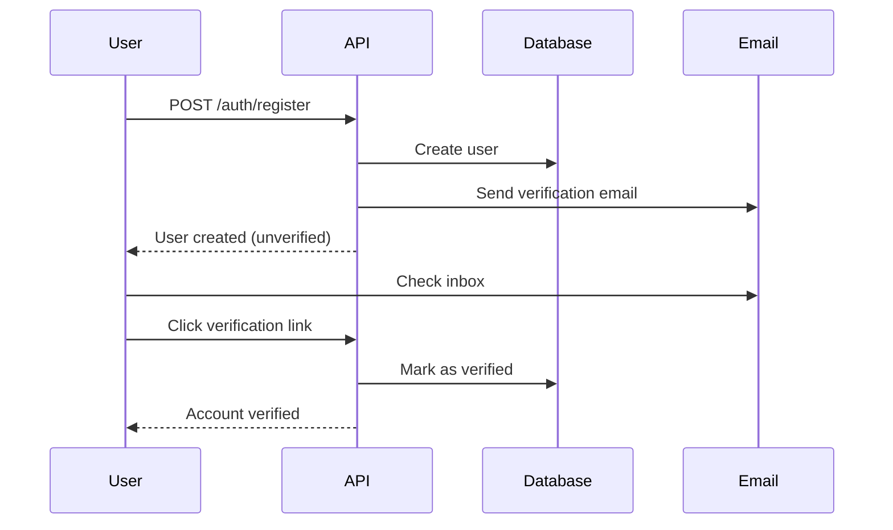
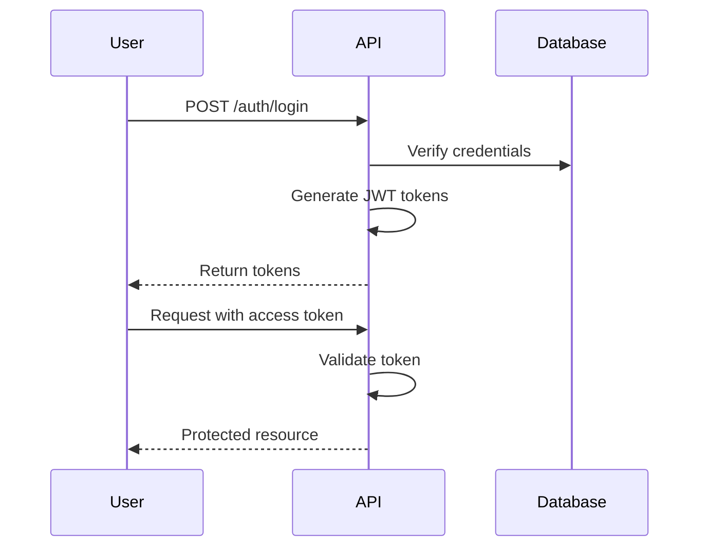
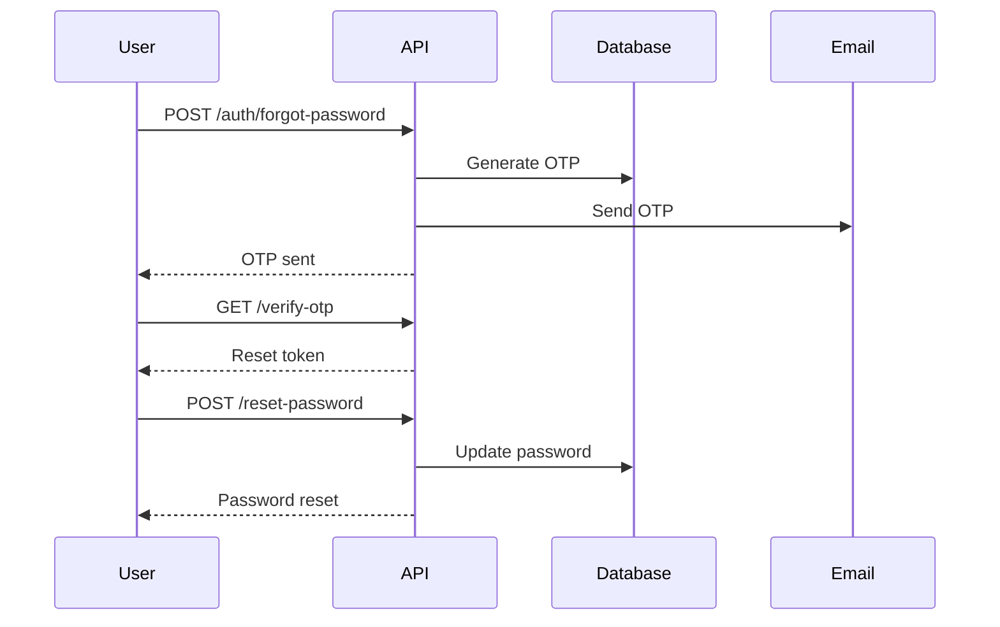

# Authentication API

API endpoints for user authentication, registration, and password management.

## Overview

The authentication system uses JWT (JSON Web Tokens) for secure, stateless authentication. It supports:

- User registration with email verification
- Login with access and refresh tokens
- Password reset via OTP
- Token refresh mechanism
- Secure logout with token blacklisting

## Endpoints

### Register New User

Create a new user account.

```http
POST /auth/register
```

**Request Body:**

```json
{
  "email": "user@example.com",
  "password": "SecurePass123!",
  "full_name": "John Doe"
}
```

**Response** (201 Created):

```json
{
  "id": 42,
  "email": "user@example.com",
  "full_name": "John Doe",
  "is_active": true,
  "is_verified": false,
  "role_id": 2,
  "created_at": "2024-01-15T10:30:00Z"
}
```

**Error Responses:**

- `400 Bad Request`: Email already registered
- `422 Unprocessable Entity`: Validation error

**Example:**

```bash
curl -X POST "http://127.0.0.1:8000/auth/register" \
  -H "Content-Type: application/json" \
  -d '{
    "email": "newuser@example.com",
    "password": "SecurePass123!",
    "full_name": "New User"
  }'
```

### Login

Authenticate user and receive access and refresh tokens.

```http
POST /auth/login
```

**Request Body:**

```json
{
  "email": "user@example.com",
  "password": "SecurePass123!"
}
```

**Response** (200 OK):

```json
{
  "access_token": "eyJhbGciOiJIUzI1NiIsInR5cCI6IkpXVCJ9...",
  "refresh_token": "eyJhbGciOiJIUzI1NiIsInR5cCI6IkpXVCJ9...",
  "token_type": "bearer"
}
```

**Token Details:**

- **Access Token**: Short-lived (30 minutes default), used for API requests
- **Refresh Token**: Long-lived (7 days default), used to get new access tokens
- **Token Type**: Always "bearer"

**Error Responses:**

- `401 Unauthorized`: Invalid credentials
- `403 Forbidden`: Account inactive or not verified

**Example:**

```bash
curl -X POST "http://127.0.0.1:8000/auth/login" \
  -H "Content-Type: application/json" \
  -d '{
    "email": "user@example.com",
    "password": "SecurePass123!"
  }'
```

### Logout

Invalidate current access token (adds to blacklist).

```http
POST /auth/logout
```

**Headers:**

```http
Authorization: Bearer <access_token>
```

**Response** (200 OK):

```json
{
  "message": "Successfully logged out"
}
```

**Example:**

```bash
curl -X POST "http://127.0.0.1:8000/auth/logout" \
  -H "Authorization: Bearer eyJhbGc..."
```

### Forgot Password

Request password reset OTP via email.

```http
POST /auth/forgot-password
```

**Request Body:**

```json
{
  "email": "user@example.com"
}
```

**Response** (200 OK):

```json
{
  "message": "Password reset OTP sent to email",
  "expires_in": 600
}
```

**Example:**

```bash
curl -X POST "http://127.0.0.1:8000/auth/forgot-password" \
  -H "Content-Type: application/json" \
  -d '{"email": "user@example.com"}'
```

### Verify Forgot Password OTP

Verify OTP and get reset token.

```http
GET /auth/verify-forgot-password-otp?otp=123456
```

**Query Parameters:**

- `otp` (string, required): 6-digit OTP code

**Response** (200 OK):

```json
{
  "reset_token": "temporary_reset_token_here",
  "expires_in": 300
}
```

**Example:**

```bash
curl "http://127.0.0.1:8000/auth/verify-forgot-password-otp?otp=123456"
```

## Authentication Flow

### Complete Registration Flow



### Login Flow



### Password Reset Flow



## Security Considerations

### Password Requirements

- Minimum 8 characters
- At least one uppercase letter
- At least one number
- At least one special character (recommended)

### Token Security

**Access Token:**
- Short expiry (30 minutes)
- Includes user ID and email
- Signed with HS256 algorithm
- Can be blacklisted on logout

**Refresh Token:**
- Longer expiry (7 days)
- Used only to get new access tokens
- Should be stored securely (httpOnly cookie recommended)

### Best Practices

1. **Store tokens securely**:
   - Web: Use httpOnly cookies
   - Mobile: Use secure storage (Keychain/Keystore)
   - Don't store in localStorage (XSS vulnerable)

2. **Handle token expiry**:
   - Refresh before expiry
   - Implement automatic refresh
   - Logout on refresh failure

3. **Validate on every request**:
   - Check token signature
   - Check expiry
   - Check blacklist

4. **Rate limiting**:
   - Login: Max 5 attempts per minute
   - Register: Max 3 per hour per IP
   - Password reset: Max 3 per hour

## Error Handling

### Common Errors

**Invalid Credentials (401):**
```json
{
  "detail": "Invalid email or password"
}
```

**Account Inactive (403):**
```json
{
  "detail": "Account is inactive. Please contact support."
}
```

**Email Already Exists (400):**
```json
{
  "detail": "Email already registered"
}
```

**Validation Error (422):**
```json
{
  "detail": [
    {
      "loc": ["body", "password"],
      "msg": "ensure this value has at least 8 characters",
      "type": "value_error.any_str.min_length"
    }
  ]
}
```

## Code Examples

### Python Client

```python
import requests

class AuthClient:
    def __init__(self, base_url: str):
        self.base_url = base_url
        self.access_token = None
        self.refresh_token = None
    
    def register(self, email: str, password: str, full_name: str):
        response = requests.post(
            f"{self.base_url}/auth/register",
            json={
                "email": email,
                "password": password,
                "full_name": full_name
            }
        )
        response.raise_for_status()
        return response.json()
    
    def login(self, email: str, password: str):
        response = requests.post(
            f"{self.base_url}/auth/login",
            json={"email": email, "password": password}
        )
        response.raise_for_status()
        
        data = response.json()
        self.access_token = data["access_token"]
        self.refresh_token = data["refresh_token"]
        return data
    
    def logout(self):
        response = requests.post(
            f"{self.base_url}/auth/logout",
            headers={"Authorization": f"Bearer {self.access_token}"}
        )
        response.raise_for_status()
        
        self.access_token = None
        self.refresh_token = None
        return response.json()

# Usage
client = AuthClient("http://127.0.0.1:8000")

# Register
user = client.register(
    "newuser@example.com",
    "SecurePass123!",
    "New User"
)
print(f"Registered: {user['email']}")

# Login
tokens = client.login("newuser@example.com", "SecurePass123!")
print(f"Logged in, token: {tokens['access_token'][:20]}...")

# Logout
client.logout()
print("Logged out successfully")
```

### JavaScript Client

```javascript
class AuthClient {
  constructor(baseURL) {
    this.baseURL = baseURL;
    this.accessToken = null;
    this.refreshToken = null;
  }

  async register(email, password, fullName) {
    const response = await fetch(`${this.baseURL}/auth/register`, {
      method: 'POST',
      headers: { 'Content-Type': 'application/json' },
      body: JSON.stringify({ email, password, full_name: fullName })
    });

    if (!response.ok) throw new Error('Registration failed');
    return response.json();
  }

  async login(email, password) {
    const response = await fetch(`${this.baseURL}/auth/login`, {
      method: 'POST',
      headers: { 'Content-Type': 'application/json' },
      body: JSON.stringify({ email, password })
    });

    if (!response.ok) throw new Error('Login failed');

    const data = await response.json();
    this.accessToken = data.access_token;
    this.refreshToken = data.refresh_token;
    
    // Store in localStorage (or better: httpOnly cookie)
    localStorage.setItem('access_token', this.accessToken);
    localStorage.setItem('refresh_token', this.refreshToken);
    
    return data;
  }

  async logout() {
    const response = await fetch(`${this.baseURL}/api/auth/logout`, {
      method: 'POST',
      headers: { 'Authorization': `Bearer ${this.accessToken}` }
    });

    if (!response.ok) throw new Error('Logout failed');

    this.accessToken = null;
    this.refreshToken = null;
    localStorage.removeItem('access_token');
    localStorage.removeItem('refresh_token');
    
    return response.json();
  }
}

// Usage
const client = new AuthClient('http://127.0.0.1:8000');

// Register
const user = await client.register(
  'newuser@example.com',
  'SecurePass123!',
  'New User'
);
console.log(`Registered: ${user.email}`);

// Login
const tokens = await client.login('newuser@example.com', 'SecurePass123!');
console.log(`Logged in`);

// Logout
await client.logout();
console.log('Logged out');
```

## Testing

### Unit Tests

```python
import pytest
from app.services.auth_service import AuthService

def test_register_success(db_session):
    service = AuthService(db_session)
    
    user = service.register(
        email="test@example.com",
        password="Test123!",
        full_name="Test User"
    )
    
    assert user.email == "test@example.com"
    assert user.is_active == True
    assert user.is_verified == False

def test_register_duplicate_email(db_session):
    service = AuthService(db_session)
    
    # First registration
    service.register("test@example.com", "Test123!", "Test User")
    
    # Duplicate should raise error
    with pytest.raises(HTTPException) as exc:
        service.register("test@example.com", "Test123!", "Test User 2")
    
    assert exc.value.status_code == 400

def test_login_success(db_session):
    service = AuthService(db_session)
    
    # Register user
    service.register("test@example.com", "Test123!", "Test User")
    
    # Login
    tokens = service.login("test@example.com", "Test123!")
    
    assert "access_token" in tokens
    assert "refresh_token" in tokens
    assert tokens["token_type"] == "bearer"
```

## Next Steps

- [User Management API](users.md)
- [Roles & Permissions API](roles-permissions.md)
- [OTP API](otp.md)
- [API Overview](overview.md)
