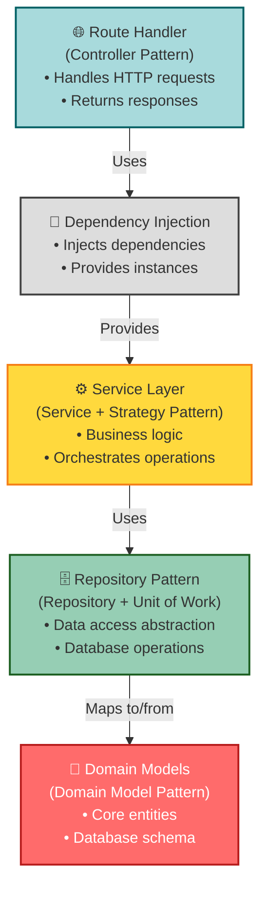

# Design Patterns

Comprehensive guide to design patterns used in this FastAPI Clean Architecture project.

## Overview

This project implements several well-established design patterns to achieve clean architecture principles. Each pattern serves a specific purpose in maintaining separation of concerns, testability, and maintainability.

## Patterns Used

### 1. Repository Pattern

**Purpose**: Abstracts data access logic and provides a collection-like interface for accessing domain objects.

**Benefits**:
- ✅ Separates business logic from data access
- ✅ Makes testing easier (can mock repositories)
- ✅ Centralizes data access logic
- ✅ Allows switching data sources without changing business logic

#### Implementation

```python
# app/repositories/user_repository.py
from sqlalchemy.orm import Session
from typing import List, Optional
from app.models.user import User
from app.schemas.user import UserCreate, UserUpdate

class UserRepository:
    """
    Repository for User entity.
    Provides collection-like interface for accessing users.
    """
    
    def __init__(self, db: Session):
        self.db = db
    
    def get_all(self, skip: int = 0, limit: int = 100) -> List[User]:
        """Get all users with pagination."""
        return self.db.query(User).offset(skip).limit(limit).all()
    
    def get_by_id(self, user_id: int) -> Optional[User]:
        """Get user by ID."""
        return self.db.query(User).filter(User.id == user_id).first()
    
    def get_by_email(self, email: str) -> Optional[User]:
        """Get user by email."""
        return self.db.query(User).filter(User.email == email).first()
    
    def create(self, user_data: UserCreate, hashed_password: str) -> User:
        """Create new user."""
        db_user = User(
            **user_data.dict(exclude={"password"}),
            hashed_password=hashed_password
        )
        self.db.add(db_user)
        self.db.commit()
        self.db.refresh(db_user)
        return db_user
    
    def update(self, user_id: int, user_data: UserUpdate) -> Optional[User]:
        """Update user."""
        db_user = self.get_by_id(user_id)
        if not db_user:
            return None
        
        update_data = user_data.dict(exclude_unset=True)
        for field, value in update_data.items():
            setattr(db_user, field, value)
        
        self.db.commit()
        self.db.refresh(db_user)
        return db_user
    
    def delete(self, user_id: int) -> bool:
        """Delete user."""
        db_user = self.get_by_id(user_id)
        if not db_user:
            return False
        
        self.db.delete(db_user)
        self.db.commit()
        return True
```

#### Usage in Service

```python
# app/services/user_service.py
class UserService:
    def __init__(self, user_repository: UserRepository):
        # Service depends on repository abstraction
        self.user_repository = user_repository
    
    def get_user(self, user_id: int) -> User:
        user = self.user_repository.get_by_id(user_id)
        if not user:
            raise HTTPException(status_code=404, detail="User not found")
        return user
```

#### Testing with Mock Repository

```python
# tests/test_user_service.py
from unittest.mock import Mock

def test_get_user():
    # Mock repository
    mock_repo = Mock(UserRepository)
    mock_repo.get_by_id.return_value = User(id=1, email="test@test.com")
    
    # Service uses mock repository
    service = UserService(mock_repo)
    user = service.get_user(1)
    
    assert user.id == 1
    assert user.email == "test@test.com"
```

### 2. Dependency Injection Pattern

**Purpose**: Provides dependencies to objects from the outside rather than having objects create their dependencies.

**Benefits**:
- ✅ Loose coupling
- ✅ Easy testing (can inject mocks)
- ✅ Better code organization
- ✅ Follows Dependency Inversion Principle

#### Implementation with FastAPI

```python
# app/api/dependencies.py
from fastapi import Depends
from sqlalchemy.orm import Session
from app.core.database import get_db
from app.repositories.user_repository import UserRepository
from app.services.user_service import UserService

def get_user_repository(db: Session = Depends(get_db)) -> UserRepository:
    """Dependency for user repository."""
    return UserRepository(db)

def get_user_service(
    user_repository: UserRepository = Depends(get_user_repository)
) -> UserService:
    """Dependency for user service."""
    return UserService(user_repository)

def get_current_user(
    credentials: HTTPAuthorizationCredentials = Depends(security),
    user_repository: UserRepository = Depends(get_user_repository)
) -> User:
    """Dependency for getting current authenticated user."""
    token = credentials.credentials
    payload = decode_token(token)
    
    user_id = payload.get("sub")
    user = user_repository.get_by_id(user_id)
    
    if not user:
        raise HTTPException(status_code=404, detail="User not found")
    
    return user
```

#### Usage in Routes

```python
# app/api/routes/user.py
from fastapi import APIRouter, Depends
from app.services.user_service import UserService
from app.api.dependencies import get_user_service, get_current_user

router = APIRouter(prefix="/users", tags=["users"])

@router.get("/{user_id}")
def get_user(
    user_id: int,
    # Dependencies are injected automatically
    service: UserService = Depends(get_user_service),
    current_user: User = Depends(get_current_user)
):
    return service.get_user(user_id)
```

### 3. Service Layer Pattern

**Purpose**: Encapsulates business logic in a separate layer, coordinating responses from multiple repositories.

**Benefits**:
- ✅ Centralized business logic
- ✅ Reusable across different interfaces (REST, GraphQL, CLI)
- ✅ Easier to test business rules
- ✅ Clear separation of concerns

#### Implementation

```python
# app/services/user_service.py
from app.repositories.user_repository import UserRepository
from app.repositories.role_repository import RoleRepository
from app.core.security import hash_password, verify_password
from app.schemas.user import UserCreate, UserUpdate

class UserService:
    """
    Service layer for user business logic.
    Orchestrates operations across multiple repositories.
    """
    
    def __init__(
        self,
        user_repository: UserRepository,
        role_repository: RoleRepository
    ):
        self.user_repository = user_repository
        self.role_repository = role_repository
    
    def create_user(self, user_data: UserCreate) -> User:
        """
        Create user with business logic.
        
        Business Rules:
        1. Email must be unique
        2. Password must be hashed
        3. Assign default role if not specified
        4. New users start unverified
        """
        # Business Rule 1: Check email uniqueness
        if self.user_repository.get_by_email(user_data.email):
            raise HTTPException(
                status_code=400,
                detail="Email already registered"
            )
        
        # Business Rule 2: Hash password
        hashed_password = hash_password(user_data.password)
        
        # Business Rule 3: Set default role
        if not user_data.role_id:
            default_role = self.role_repository.get_by_name("user")
            user_data.role_id = default_role.id
        
        # Business Rule 4: Create user (unverified)
        user = self.user_repository.create(user_data, hashed_password)
        
        return user
    
    def change_password(
        self,
        user_id: int,
        old_password: str,
        new_password: str
    ) -> User:
        """
        Change user password with validation.
        
        Business Rules:
        1. Old password must be correct
        2. New password must be different
        3. New password must meet complexity requirements
        """
        user = self.user_repository.get_by_id(user_id)
        if not user:
            raise HTTPException(status_code=404, detail="User not found")
        
        # Business Rule 1: Verify old password
        if not verify_password(old_password, user.hashed_password):
            raise HTTPException(
                status_code=400,
                detail="Incorrect password"
            )
        
        # Business Rule 2: New password must be different
        if old_password == new_password:
            raise HTTPException(
                status_code=400,
                detail="New password must be different"
            )
        
        # Business Rule 3: Hash new password
        hashed_password = hash_password(new_password)
        
        # Update password
        user.hashed_password = hashed_password
        self.user_repository.update(user_id, user)
        
        return user
```

### 4. Data Transfer Object (DTO) Pattern

**Purpose**: Uses simple objects to transfer data between layers, validating and transforming data.

**Benefits**:
- ✅ Clear API contracts
- ✅ Automatic validation
- ✅ Documentation generation
- ✅ Type safety

#### Implementation with Pydantic

```python
# app/schemas/user.py
from pydantic import BaseModel, EmailStr, Field, validator
from typing import Optional
from datetime import datetime

class UserBase(BaseModel):
    """Base user schema with common fields."""
    email: EmailStr
    full_name: Optional[str] = None

class UserCreate(UserBase):
    """Schema for creating a user."""
    password: str = Field(..., min_length=8, max_length=100)
    role_id: Optional[int] = None
    
    @validator('password')
    def password_complexity(cls, v):
        """Validate password complexity."""
        if not any(char.isdigit() for char in v):
            raise ValueError('Password must contain at least one digit')
        if not any(char.isupper() for char in v):
            raise ValueError('Password must contain at least one uppercase letter')
        return v

class UserUpdate(BaseModel):
    """Schema for updating a user."""
    email: Optional[EmailStr] = None
    full_name: Optional[str] = None
    is_active: Optional[bool] = None
    role_id: Optional[int] = None

class UserResponse(UserBase):
    """Schema for user responses (no sensitive data)."""
    id: int
    is_active: bool
    is_verified: bool
    role_id: int
    created_at: datetime
    
    class Config:
        from_attributes = True  # Allow creation from ORM models

class UserInDB(UserResponse):
    """Schema including sensitive data (internal use only)."""
    hashed_password: str
```

#### Usage

```python
# Automatic validation
user_data = UserCreate(
    email="user@example.com",
    password="Pass123!"  # Automatically validated
)

# Convert from ORM model to response
db_user = User(id=1, email="user@example.com", ...)
response = UserResponse.from_orm(db_user)

# Automatic JSON serialization
return response  # FastAPI automatically converts to JSON
```

### 5. Factory Pattern

**Purpose**: Creates objects without specifying the exact class.

**Benefits**:
- ✅ Centralized object creation
- ✅ Easy to add new types
- ✅ Encapsulates creation logic

#### Implementation

```python
# app/core/security.py
from passlib.context import CryptContext
from jose import jwt
from datetime import datetime, timedelta
from app.core.config import settings

pwd_context = CryptContext(schemes=["bcrypt"], deprecated="auto")

class TokenFactory:
    """Factory for creating JWT tokens."""
    
    @staticmethod
    def create_access_token(data: dict) -> str:
        """Create JWT access token."""
        to_encode = data.copy()
        expire = datetime.utcnow() + timedelta(
            minutes=settings.ACCESS_TOKEN_EXPIRE_MINUTES
        )
        to_encode.update({"exp": expire, "type": "access"})
        
        encoded_jwt = jwt.encode(
            to_encode,
            settings.SECRET_KEY,
            algorithm=settings.ALGORITHM
        )
        return encoded_jwt
    
    @staticmethod
    def create_refresh_token(data: dict) -> str:
        """Create JWT refresh token."""
        to_encode = data.copy()
        expire = datetime.utcnow() + timedelta(
            days=settings.REFRESH_TOKEN_EXPIRE_DAYS
        )
        to_encode.update({"exp": expire, "type": "refresh"})
        
        encoded_jwt = jwt.encode(
            to_encode,
            settings.SECRET_KEY,
            algorithm=settings.ALGORITHM
        )
        return encoded_jwt

# Usage
access_token = TokenFactory.create_access_token({"sub": str(user.id)})
refresh_token = TokenFactory.create_refresh_token({"sub": str(user.id)})
```

### 6. Strategy Pattern

**Purpose**: Defines a family of algorithms, encapsulates each one, and makes them interchangeable.

**Benefits**:
- ✅ Open/Closed Principle
- ✅ Easy to add new strategies
- ✅ Avoids conditional logic

#### Implementation Example

```python
# app/services/notification_service.py
from abc import ABC, abstractmethod

class NotificationStrategy(ABC):
    """Abstract notification strategy."""
    
    @abstractmethod
    async def send(self, recipient: str, message: str):
        pass

class EmailNotificationStrategy(NotificationStrategy):
    """Send notification via email."""
    
    async def send(self, recipient: str, message: str):
        # Email sending logic
        await send_email(recipient, message)

class SMSNotificationStrategy(NotificationStrategy):
    """Send notification via SMS."""
    
    async def send(self, recipient: str, message: str):
        # SMS sending logic
        await send_sms(recipient, message)

class NotificationService:
    """Service using strategy pattern."""
    
    def __init__(self, strategy: NotificationStrategy):
        self.strategy = strategy
    
    async def notify(self, recipient: str, message: str):
        await self.strategy.send(recipient, message)

# Usage
email_service = NotificationService(EmailNotificationStrategy())
await email_service.notify("user@example.com", "Hello!")

sms_service = NotificationService(SMSNotificationStrategy())
await sms_service.notify("+1234567890", "Hello!")
```

### 7. Decorator Pattern

**Purpose**: Adds behavior to objects dynamically.

**Benefits**:
- ✅ Add functionality without modifying code
- ✅ Composable
- ✅ Follows Open/Closed Principle

#### Implementation with FastAPI Dependencies

```python
# app/api/dependencies.py
from functools import wraps

def require_permission(permission: str):
    """Decorator to require specific permission."""
    
    def decorator(func):
        @wraps(func)
        async def wrapper(
            *args,
            current_user: User = Depends(get_current_user),
            **kwargs
        ):
            # Check if user has permission
            user_permissions = [p.name for p in current_user.role.permissions]
            
            if permission not in user_permissions:
                raise HTTPException(
                    status_code=403,
                    detail=f"Permission '{permission}' required"
                )
            
            return await func(*args, current_user=current_user, **kwargs)
        
        return wrapper
    return decorator

# Usage
@router.post("/users")
@require_permission("user:create")
async def create_user(user_data: UserCreate):
    # Only users with 'user:create' permission can access
    pass
```

### 8. Singleton Pattern

**Purpose**: Ensures a class has only one instance and provides global access.

**Benefits**:
- ✅ Controlled access to single instance
- ✅ Reduced memory usage
- ✅ Global state management

#### Implementation

```python
# app/core/config.py
from pydantic_settings import BaseSettings
from functools import lru_cache

class Settings(BaseSettings):
    """Application settings."""
    
    PROJECT_NAME: str = "FastAPI Clean Architecture"
    DATABASE_URL: str
    SECRET_KEY: str
    ALGORITHM: str = "HS256"
    ACCESS_TOKEN_EXPIRE_MINUTES: int = 30
    
    class Config:
        env_file = ".env"

@lru_cache()
def get_settings() -> Settings:
    """Get settings singleton."""
    return Settings()

# Usage
settings = get_settings()  # Always returns same instance
```

### 9. Observer Pattern (Event-Driven)

**Purpose**: Notifies multiple objects about state changes.

**Benefits**:
- ✅ Loose coupling
- ✅ Easily add new observers
- ✅ Asynchronous processing

#### Implementation Example

```python
# app/core/events.py
from typing import List, Callable
from dataclasses import dataclass

@dataclass
class UserCreatedEvent:
    """Event fired when user is created."""
    user_id: int
    email: str

class EventDispatcher:
    """Event dispatcher for handling domain events."""
    
    def __init__(self):
        self._listeners: dict[type, List[Callable]] = {}
    
    def subscribe(self, event_type: type, listener: Callable):
        """Subscribe to an event."""
        if event_type not in self._listeners:
            self._listeners[event_type] = []
        self._listeners[event_type].append(listener)
    
    async def dispatch(self, event):
        """Dispatch event to all listeners."""
        event_type = type(event)
        if event_type in self._listeners:
            for listener in self._listeners[event_type]:
                await listener(event)

# app/services/user_service.py
class UserService:
    def __init__(
        self,
        user_repository: UserRepository,
        event_dispatcher: EventDispatcher
    ):
        self.user_repository = user_repository
        self.event_dispatcher = event_dispatcher
    
    async def create_user(self, user_data: UserCreate) -> User:
        # Create user
        user = self.user_repository.create(user_data)
        
        # Dispatch event
        await self.event_dispatcher.dispatch(
            UserCreatedEvent(user_id=user.id, email=user.email)
        )
        
        return user

# Event listeners
async def send_welcome_email(event: UserCreatedEvent):
    """Listener for UserCreatedEvent."""
    # Send welcome email
    pass

async def create_user_profile(event: UserCreatedEvent):
    """Another listener for UserCreatedEvent."""
    # Create user profile
    pass

# Subscribe listeners
dispatcher = EventDispatcher()
dispatcher.subscribe(UserCreatedEvent, send_welcome_email)
dispatcher.subscribe(UserCreatedEvent, create_user_profile)
```

### 10. Unit of Work Pattern

**Purpose**: Maintains a list of objects affected by a business transaction and coordinates writing changes.

**Benefits**:
- ✅ Transactional consistency
- ✅ Reduced database calls
- ✅ Clear transaction boundaries

#### Implementation

```python
# app/core/unit_of_work.py
from sqlalchemy.orm import Session
from contextlib import contextmanager

class UnitOfWork:
    """Unit of Work pattern implementation."""
    
    def __init__(self, db: Session):
        self.db = db
        self._user_repository = None
        self._role_repository = None
    
    @property
    def user_repository(self):
        if self._user_repository is None:
            self._user_repository = UserRepository(self.db)
        return self._user_repository
    
    @property
    def role_repository(self):
        if self._role_repository is None:
            self._role_repository = RoleRepository(self.db)
        return self._role_repository
    
    def commit(self):
        """Commit transaction."""
        self.db.commit()
    
    def rollback(self):
        """Rollback transaction."""
        self.db.rollback()

@contextmanager
def get_unit_of_work(db: Session):
    """Context manager for unit of work."""
    uow = UnitOfWork(db)
    try:
        yield uow
        uow.commit()
    except Exception:
        uow.rollback()
        raise

# Usage
with get_unit_of_work(db) as uow:
    # All operations in same transaction
    user = uow.user_repository.create(user_data)
    role = uow.role_repository.get_by_id(role_id)
    user.role = role
    # Automatically commits on exit
```

## Pattern Relationships



## Best Practices

### 1. Keep Services Focused

```python
# ❌ Bad - Service doing too much
class UserService:
    def create_user_and_send_email_and_log(self, user_data):
        # Too many responsibilities
        pass

# ✅ Good - Single responsibility
class UserService:
    def create_user(self, user_data):
        # Only user creation logic
        pass

class EmailService:
    def send_welcome_email(self, user):
        # Only email logic
        pass
```

### 2. Use DTOs for API Boundaries

```python
# ✅ Good - Separate schemas for input/output
class UserCreate(BaseModel):
    email: EmailStr
    password: str  # Input includes password

class UserResponse(BaseModel):
    id: int
    email: EmailStr  # Output excludes password
```

### 3. Keep Repositories Simple

```python
# ✅ Good - Repository only does data access
class UserRepository:
    def get_by_email(self, email: str) -> Optional[User]:
        return self.db.query(User).filter(User.email == email).first()

# ❌ Bad - Business logic in repository
class UserRepository:
    def get_active_verified_users_with_premium_role(self):
        # Too specific, business logic leaking into repository
        pass
```

## Summary

| Pattern | Purpose | Location |
|---------|---------|----------|
| Repository | Data access abstraction | `app/repositories/` |
| Dependency Injection | Loose coupling | `app/api/dependencies.py` |
| Service Layer | Business logic | `app/services/` |
| DTO | Data transfer | `app/schemas/` |
| Factory | Object creation | `app/core/security.py` |
| Strategy | Algorithm selection | `app/services/` |
| Decorator | Add behavior | FastAPI dependencies |
| Singleton | Single instance | `app/core/config.py` |
| Observer | Event handling | `app/core/events.py` |
| Unit of Work | Transaction management | `app/core/unit_of_work.py` |

## Learn More

- [Architecture Overview](overview.md)
- [Layers in Detail](layers.md)
- [Best Practices](../development/best-practices.md)
