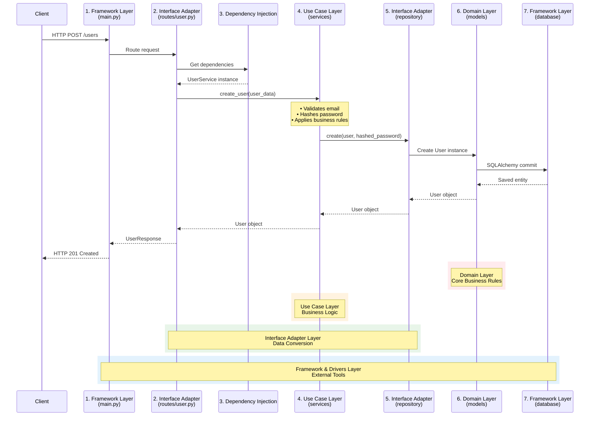
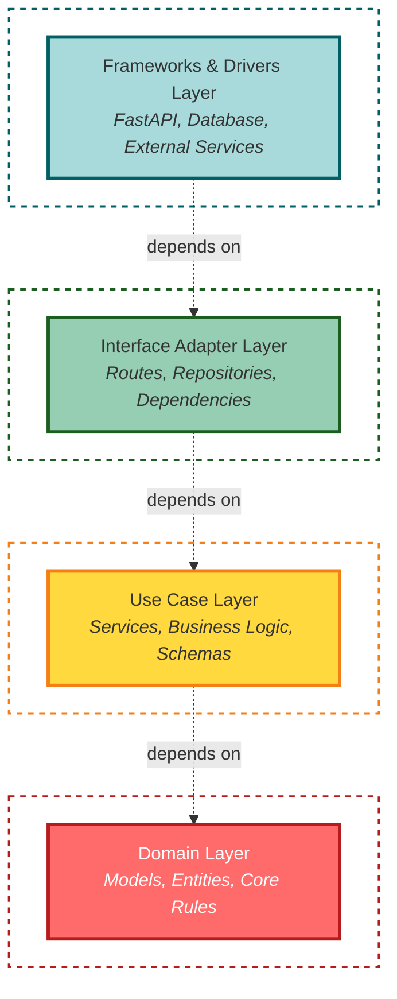

# Architecture Layers

Detailed explanation of each layer in the clean architecture implementation.

## Layer Hierarchy

The application follows a four-layer architecture. Each layer has specific responsibilities and dependencies flow inward:


<br>- FastAPI, Database, External Services


<br>- Routes, Repositories, Dependencies


<br>- Services, Business Logic


<br>- Models, Entities, Core Logic

## Layer 1: Domain Layer

**Purpose**: Contains enterprise-wide business rules and entities.

**Location**: `app/models/`

### Characteristics

- ✅ **Most stable** - Changes least frequently
- ✅ **No dependencies** - Doesn't depend on any other layer
- ✅ **Pure business logic** - No framework code
- ✅ **Framework agnostic** - Can work with any framework

### Components

#### 1. Database Models

Define the core entities of the system:

```python
# app/models/user.py
from sqlalchemy import Column, Integer, String, Boolean, ForeignKey
from sqlalchemy.orm import relationship
from app.core.database import Base

class User(Base):
    """User entity representing a system user."""
    
    __tablename__ = "users"
    
    # Attributes
    id = Column(Integer, primary_key=True, index=True)
    email = Column(String, unique=True, index=True, nullable=False)
    hashed_password = Column(String, nullable=False)
    full_name = Column(String)
    is_active = Column(Boolean, default=True)
    is_verified = Column(Boolean, default=False)
    
    # Relationships
    role_id = Column(Integer, ForeignKey("roles.id"))
    role = relationship("Role", back_populates="users")
```

#### 2. Domain Entities

Key entities in this layer:

- **User** - System user with authentication
- **Role** - User role for authorization
- **Permission** - Specific permissions
- **OTP** - One-time password for verification
- **TokenBlacklist** - Invalidated JWT tokens

### Responsibilities

- ✅ Define data structures
- ✅ Contain domain logic (if any)
- ✅ Define relationships between entities
- ✅ Enforce data integrity rules (via constraints)

### Example: Role Model

```python
# app/models/role.py
class Role(Base):
    __tablename__ = "roles"
    
    id = Column(Integer, primary_key=True, index=True)
    name = Column(String, unique=True, nullable=False)
    description = Column(String)
    
    # Relationships
    users = relationship("User", back_populates="role")
    permissions = relationship(
        "Permission",
        secondary="permission_role",
        back_populates="roles"
    )
```

### Why SQLAlchemy Models?

While pure domain models shouldn't depend on frameworks, we use SQLAlchemy models because:

1. **Practical compromise** - In Python, ORM models are convenient
2. **Abstraction level** - SQLAlchemy provides good abstraction
3. **Small projects** - For larger projects, consider separate domain models
4. **Easy to change** - Can add pure domain layer later if needed

## Layer 2: Use Case Layer

**Purpose**: Contains application-specific business rules.

**Location**: `app/services/`, `app/schemas/`

### Characteristics

- ✅ **Orchestrates** data flow between entities
- ✅ **Implements** application-specific business rules
- ✅ **Independent** of UI and database details
- ✅ **Depends only on** Domain layer

### Components

#### 1. Services (Business Logic)

```python
# app/services/user_service.py
from app.repositories.user_repository import UserRepository
from app.schemas.user import UserCreate, UserUpdate
from app.core.security import hash_password

class UserService:
    """User service containing business logic."""
    
    def __init__(self, user_repository: UserRepository):
        self.user_repository = user_repository
    
    def create_user(self, user_data: UserCreate) -> User:
        """
        Create a new user with business logic.
        
        Business Rules:
        - Email must be unique
        - Password must be hashed
        - Default role if not specified
        """
        # Check if email exists
        existing = self.user_repository.get_by_email(user_data.email)
        if existing:
            raise HTTPException(
                status_code=400,
                detail="Email already registered"
            )
        
        # Hash password
        hashed_password = hash_password(user_data.password)
        
        # Create user with default role if not provided
        if not user_data.role_id:
            default_role = self.user_repository.get_default_role()
            user_data.role_id = default_role.id
        
        # Delegate to repository
        return self.user_repository.create(user_data, hashed_password)
    
    def update_user(self, user_id: int, user_data: UserUpdate) -> User:
        """Update user with validation."""
        # Verify user exists
        user = self.user_repository.get_by_id(user_id)
        if not user:
            raise HTTPException(status_code=404, detail="User not found")
        
        # If changing email, check uniqueness
        if user_data.email and user_data.email != user.email:
            if self.user_repository.get_by_email(user_data.email):
                raise HTTPException(
                    status_code=400,
                    detail="Email already in use"
                )
        
        return self.user_repository.update(user_id, user_data)
```

#### 2. Schemas (DTOs - Data Transfer Objects)

Schemas define the shape of data moving between layers:

```python
# app/schemas/user.py
from pydantic import BaseModel, EmailStr, Field
from typing import Optional

class UserBase(BaseModel):
    """Base user schema with common attributes."""
    email: EmailStr
    full_name: Optional[str] = None

class UserCreate(UserBase):
    """Schema for creating a user."""
    password: str = Field(..., min_length=8)
    role_id: Optional[int] = None

class UserUpdate(BaseModel):
    """Schema for updating a user."""
    email: Optional[EmailStr] = None
    full_name: Optional[str] = None
    is_active: Optional[bool] = None
    role_id: Optional[int] = None

class UserResponse(UserBase):
    """Schema for user responses."""
    id: int
    is_active: bool
    is_verified: bool
    role_id: int
    
    class Config:
        from_attributes = True
```

### Service Examples

#### Authentication Service

```python
# app/services/auth_service.py
class AuthService:
    def __init__(
        self,
        user_repository: UserRepository,
        token_blacklist_service: TokenBlacklistService
    ):
        self.user_repository = user_repository
        self.token_blacklist_service = token_blacklist_service
    
    def login(self, email: str, password: str) -> dict:
        """Authenticate user and generate tokens."""
        # Verify credentials
        user = self.user_repository.get_by_email(email)
        if not user or not verify_password(password, user.hashed_password):
            raise HTTPException(status_code=401, detail="Invalid credentials")
        
        # Check if active
        if not user.is_active:
            raise HTTPException(status_code=403, detail="Account inactive")
        
        # Generate tokens
        access_token = create_access_token(user.id)
        refresh_token = create_refresh_token(user.id)
        
        return {
            "access_token": access_token,
            "refresh_token": refresh_token,
            "token_type": "bearer"
        }
    
    def logout(self, token: str) -> None:
        """Invalidate access token."""
        self.token_blacklist_service.add_token(token)
```

### Responsibilities

- ✅ Implement business logic
- ✅ Coordinate between repositories
- ✅ Validate business rules
- ✅ Handle errors and exceptions
- ✅ Transform data using schemas
- ❌ No HTTP/API concerns
- ❌ No database queries directly

## Layer 3: Interface Adapters Layer

**Purpose**: Convert data between use cases and external interfaces.

**Location**: `app/api/routes/`, `app/repositories/`, `app/api/dependencies.py`

### Characteristics

- ✅ **Adapts** external formats to internal formats
- ✅ **Converts** between different data representations
- ✅ **Depends on** Use Case and Domain layers
- ❌ **No business logic** (only orchestration)

### Components

#### 1. API Routes (Controllers)

Handle HTTP requests and responses:

```python
# app/api/routes/user.py
from fastapi import APIRouter, Depends, HTTPException, status
from typing import List
from app.schemas.user import UserCreate, UserResponse, UserUpdate
from app.services.user_service import UserService
from app.api.dependencies import get_current_user, get_user_service

router = APIRouter(prefix="/users", tags=["users"])

@router.post(
    "/",
    response_model=UserResponse,
    status_code=status.HTTP_201_CREATED
)
def create_user(
    user_data: UserCreate,
    service: UserService = Depends(get_user_service)
):
    """Create a new user."""
    return service.create_user(user_data)

@router.get("/{user_id}", response_model=UserResponse)
def get_user(
    user_id: int,
    service: UserService = Depends(get_user_service),
    current_user = Depends(get_current_user)
):
    """Get user by ID."""
    user = service.get_user_by_id(user_id)
    if not user:
        raise HTTPException(status_code=404, detail="User not found")
    return user

@router.put("/{user_id}", response_model=UserResponse)
def update_user(
    user_id: int,
    user_data: UserUpdate,
    service: UserService = Depends(get_user_service),
    current_user = Depends(get_current_user)
):
    """Update user."""
    return service.update_user(user_id, user_data)

@router.delete("/{user_id}", status_code=status.HTTP_204_NO_CONTENT)
def delete_user(
    user_id: int,
    service: UserService = Depends(get_user_service),
    current_user = Depends(get_current_user)
):
    """Delete user."""
    service.delete_user(user_id)
    return None
```

#### 2. Repositories (Data Access)

Abstract database operations:

```python
# app/repositories/user_repository.py
from sqlalchemy.orm import Session
from typing import List, Optional
from app.models.user import User
from app.schemas.user import UserCreate, UserUpdate

class UserRepository:
    """Repository for user data access."""
    
    def __init__(self, db: Session):
        self.db = db
    
    def get_all(self, skip: int = 0, limit: int = 100) -> List[User]:
        """Get all users with pagination."""
        return self.db.query(User).offset(skip).limit(limit).all()
    
    def get_by_id(self, user_id: int) -> Optional[User]:
        """Get user by ID."""
        return self.db.query(User).filter(User.id == user_id).first()
    
    def get_by_email(self, email: str) -> Optional[User]:
        """Get user by email."""
        return self.db.query(User).filter(User.email == email).first()
    
    def create(self, user_data: UserCreate, hashed_password: str) -> User:
        """Create a new user."""
        db_user = User(
            **user_data.dict(exclude={"password"}),
            hashed_password=hashed_password
        )
        self.db.add(db_user)
        self.db.commit()
        self.db.refresh(db_user)
        return db_user
    
    def update(self, user_id: int, user_data: UserUpdate) -> User:
        """Update user."""
        db_user = self.get_by_id(user_id)
        
        update_data = user_data.dict(exclude_unset=True)
        for field, value in update_data.items():
            setattr(db_user, field, value)
        
        self.db.commit()
        self.db.refresh(db_user)
        return db_user
    
    def delete(self, user_id: int) -> None:
        """Delete user."""
        db_user = self.get_by_id(user_id)
        self.db.delete(db_user)
        self.db.commit()
```

#### 3. Dependencies

Provide dependency injection:

```python
# app/api/dependencies.py
from fastapi import Depends, HTTPException, status
from fastapi.security import HTTPBearer, HTTPAuthorizationCredentials
from sqlalchemy.orm import Session
from app.core.database import get_db
from app.core.security import decode_token
from app.repositories.user_repository import UserRepository
from app.services.user_service import UserService
from app.models.user import User

security = HTTPBearer()

def get_user_service(db: Session = Depends(get_db)) -> UserService:
    """Get user service with dependencies."""
    return UserService(UserRepository(db))

def get_current_user(
    credentials: HTTPAuthorizationCredentials = Depends(security),
    db: Session = Depends(get_db)
) -> User:
    """Get current authenticated user."""
    token = credentials.credentials
    
    # Decode token
    payload = decode_token(token)
    if not payload:
        raise HTTPException(
            status_code=status.HTTP_401_UNAUTHORIZED,
            detail="Invalid authentication credentials"
        )
    
    # Get user
    user_id = payload.get("sub")
    repository = UserRepository(db)
    user = repository.get_by_id(user_id)
    
    if not user:
        raise HTTPException(status_code=404, detail="User not found")
    
    return user
```

### Responsibilities

- ✅ Handle HTTP requests/responses
- ✅ Perform database operations
- ✅ Convert between data formats
- ✅ Dependency injection
- ❌ No business logic

## Layer 4: Frameworks & Drivers Layer

**Purpose**: Contains frameworks and tools.

**Location**: `app/main.py`, `app/core/`

### Characteristics

- ✅ **Outermost layer** - Most volatile
- ✅ **Glue code** - Connects everything together
- ✅ **Framework code** - FastAPI, SQLAlchemy, etc.
- ✅ **Depends on** all inner layers

### Components

#### 1. FastAPI Application

```python
# app/main.py
from fastapi import FastAPI
from fastapi.middleware.cors import CORSMiddleware
from app.api.routes import auth, user, role, permission, otp, me
from app.core.config import settings
from app.core.database import engine
from app.models import user, role, permission

# Create tables
user.Base.metadata.create_all(bind=engine)

# Create FastAPI app
app = FastAPI(
    title=settings.PROJECT_NAME,
    version="1.0.0",
    description="FastAPI Clean Architecture with JWT Authentication"
)

# CORS middleware
app.add_middleware(
    CORSMiddleware,
    allow_origins=settings.ALLOWED_ORIGINS,
    allow_credentials=True,
    allow_methods=["*"],
    allow_headers=["*"],
)

# Include routers
app.include_router(auth.router)
app.include_router(user.router)
app.include_router(role.router)
app.include_router(permission.router)
app.include_router(otp.router)
app.include_router(me.router)

@app.get("/")
def root():
    return {"message": "FastAPI Clean Architecture"}
```

#### 2. Database Configuration

```python
# app/core/database.py
from sqlalchemy import create_engine
from sqlalchemy.ext.declarative import declarative_base
from sqlalchemy.orm import sessionmaker
from app.core.config import settings

# Create engine
engine = create_engine(
    settings.DATABASE_URL,
    pool_pre_ping=True,
    pool_recycle=3600,
)

# Session factory
SessionLocal = sessionmaker(autocommit=False, autoflush=False, bind=engine)

# Base class for models
Base = declarative_base()

def get_db():
    """Dependency for database session."""
    db = SessionLocal()
    try:
        yield db
    finally:
        db.close()
```

#### 3. Configuration

```python
# app/core/config.py
from pydantic_settings import BaseSettings
from typing import List

class Settings(BaseSettings):
    # App
    PROJECT_NAME: str = "FastAPI Clean Architecture"
    
    # Database
    DATABASE_URL: str
    
    # Security
    SECRET_KEY: str
    ALGORITHM: str = "HS256"
    ACCESS_TOKEN_EXPIRE_MINUTES: int = 30
    
    # CORS
    ALLOWED_ORIGINS: List[str] = ["*"]
    
    class Config:
        env_file = ".env"

settings = Settings()
```

#### 4. External Services

```python
# app/services/email_service.py
import aiosmtplib
from email.mime.text import MIMEText
from app.core.config import settings

class EmailService:
    """Email service using SMTP."""
    
    async def send_email(self, to: str, subject: str, body: str):
        """Send email via SMTP."""
        message = MIMEText(body, "html")
        message["From"] = settings.SMTP_FROM
        message["To"] = to
        message["Subject"] = subject
        
        await aiosmtplib.send(
            message,
            hostname=settings.SMTP_HOST,
            port=settings.SMTP_PORT,
            username=settings.SMTP_USER,
            password=settings.SMTP_PASSWORD,
            use_tls=True
        )
```

### Responsibilities

- ✅ Configure frameworks
- ✅ Setup external services
- ✅ Application entry point
- ✅ Middleware and configuration
- ✅ Connect all layers

## Layer Interaction Example

Let's trace a request through all layers:

**Request**: `POST /users` with `{"email": "user@example.com", "password": "pass123"}`



## Summary

### Layer Dependencies



### Key Principles

1. **Dependency Rule**: Dependencies point inward
2. **Separation of Concerns**: Each layer has one responsibility
3. **Testability**: Inner layers can be tested independently
4. **Independence**: Business logic doesn't depend on frameworks

### File Organization

```
app/
├── models/           # Domain Layer
├── schemas/          # Use Case Layer
├── services/         # Use Case Layer
├── repositories/     # Interface Adapter Layer
├── api/              # Interface Adapter Layer
│   ├── routes/
│   └── dependencies.py
└── core/             # Framework Layer
    ├── config.py
    ├── database.py
    └── security.py
```

## Next Steps

- [Data Flow](data-flow.md) - See how data moves through layers
- [Design Patterns](design-patterns.md) - Learn about patterns used
- [API Documentation](../api/overview.md) - Explore the API
