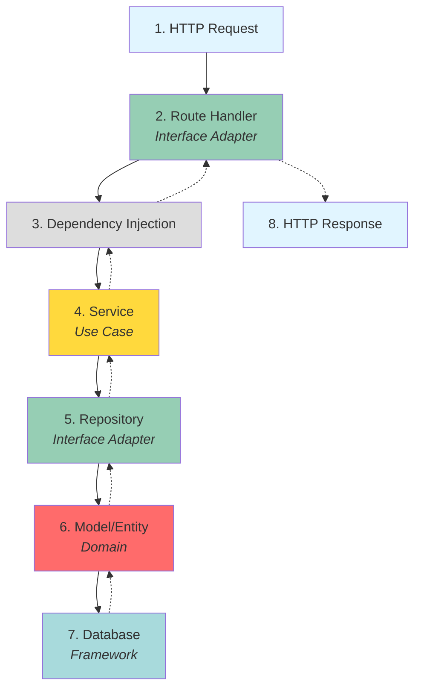
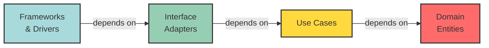

# Architecture Overview

Learn about the clean architecture implementation in FastAPI Clean Architecture.

## What is Clean Architecture?

Clean Architecture is a software design philosophy that separates the elements of a design into ring levels. The main rule of clean architecture is that code dependencies can only come from the outer levels inward. Code on the inner layers can have no knowledge of functions on the outer layers.

## Architecture Principles

This project follows these key principles:

1. **Independent of Frameworks** - The architecture doesn't depend on the existence of some library of feature-laden software
2. **Testable** - The business rules can be tested without the UI, database, web server, or any other external element
3. **Independent of UI** - The UI can change easily, without changing the rest of the system
4. **Independent of Database** - You can swap out PostgreSQL for MySQL, MongoDB, or something else
5. **Independent of any external agency** - Business rules don't know anything about the outside world

## Layer Structure

The application is organized into four main layers:


<br>- FastAPI, Database, Email Service


<br>- Routes, Repositories, Dependencies


<br>- Services, Business Logic


<br>- Models, Entities

### 1. Domain Layer (Enterprise Business Rules)

**Location**: `app/models/`

The innermost layer contains enterprise-wide business rules and entities.

**Components**:
- Database models (User, Role, Permission, etc.)
- Core business entities
- Domain logic independent of application use cases

**Example**:
```python
# app/models/user.py
class User(Base):
    __tablename__ = "users"
    
    id = Column(Integer, primary_key=True, index=True)
    email = Column(String, unique=True, index=True)
    hashed_password = Column(String)
    role_id = Column(Integer, ForeignKey("roles.id"))
    is_active = Column(Boolean, default=True)
```

**Characteristics**:
- ✅ No dependencies on outer layers
- ✅ Pure Python classes
- ✅ Database-agnostic (uses SQLAlchemy abstractions)

### 2. Use Case Layer (Application Business Rules)

**Location**: `app/services/`, `app/schemas/`

Contains application-specific business rules and orchestrates data flow.

**Components**:
- Services (business logic)
- DTOs (Data Transfer Objects) using Pydantic schemas
- Use case implementations

**Example**:
```python
# app/services/user_service.py
class UserService:
    def __init__(self, user_repository: UserRepository):
        self.user_repository = user_repository
    
    def create_user(self, user_data: UserCreate) -> User:
        # Business logic
        if self.user_repository.get_by_email(user_data.email):
            raise HTTPException(status_code=400, detail="Email exists")
        
        hashed_password = hash_password(user_data.password)
        return self.user_repository.create(user_data, hashed_password)
```

**Characteristics**:
- ✅ Orchestrates data flow between entities
- ✅ Contains application-specific business rules
- ✅ Independent of UI and database implementations

### 3. Interface Adapters Layer

**Location**: `app/api/routes/`, `app/repositories/`, `app/api/dependencies.py`

Converts data from the format most convenient for use cases and entities to the format most convenient for external agencies.

**Components**:
- API routes (HTTP request/response handlers)
- Repositories (data access abstractions)
- Dependency injection

**Example - Routes**:
```python
# app/api/routes/user.py
@router.post("/", response_model=User)
def create_user(
    user: UserCreate,
    service: UserService = Depends(get_user_service)
):
    return service.create_user(user)
```

**Example - Repository**:
```python
# app/repositories/user_repository.py
class UserRepository:
    def __init__(self, db: Session):
        self.db = db
    
    def get_by_email(self, email: str) -> Optional[User]:
        return self.db.query(User).filter(User.email == email).first()
```

**Characteristics**:
- ✅ Adapts external interfaces to internal use cases
- ✅ Handles data transformation
- ✅ No business logic (only orchestration)

### 4. Frameworks & Drivers Layer

**Location**: `app/core/`, `app/main.py`, external libraries

The outermost layer consisting of frameworks and tools.

**Components**:
- FastAPI framework
- Database connection (SQLAlchemy)
- Configuration
- Email service
- Logging

**Example**:
```python
# app/main.py
app = FastAPI(
    title="FastAPI Clean Architecture",
    version="1.0.0"
)

app.include_router(auth.router)
app.include_router(user.router)
app.include_router(role.router)
```

**Characteristics**:
- ✅ Contains all external frameworks
- ✅ Glues everything together
- ✅ Most likely to change

## Data Flow

Here's how a typical request flows through the layers:



### Example: Creating a User

```python
# 1. HTTP POST /users
# Request: {"email": "user@example.com", "password": "pass123"}

# 2. Route Handler
@router.post("/users")
def create_user(user: UserCreate, service: UserService = Depends()):
    # 3. Dependency injection provides service
    
    # 4. Service handles business logic
    return service.create_user(user)

# 5. Service uses repository
class UserService:
    def create_user(self, user_data: UserCreate):
        # Validate, hash password, etc.
        return self.user_repository.create(user_data)

# 6. Repository interacts with database
class UserRepository:
    def create(self, user_data):
        # 7. Database operation
        db_user = User(**user_data.dict())
        self.db.add(db_user)
        self.db.commit()
        return db_user
```

## Dependency Rule

**The Dependency Rule**: Source code dependencies must point only inward, toward higher-level policies.



- Inner layers know nothing about outer layers
- Outer layers depend on inner layers
- This allows inner layers to be independent and reusable

## Benefits

### 1. Testability

You can test business logic without:
- Database
- Web framework
- External APIs
- UI

```python
# Test service without database
def test_create_user():
    mock_repo = Mock(UserRepository)
    service = UserService(mock_repo)
    
    user = service.create_user(UserCreate(email="test@test.com"))
    assert user.email == "test@test.com"
```

### 2. Framework Independence

Want to switch from FastAPI to Flask? Only change the outer layer:

- ✅ Business logic stays the same
- ✅ Models stay the same
- ✅ Services stay the same
- ❌ Only routes need changes

### 3. Database Independence

Switch from PostgreSQL to MongoDB:

- ✅ Business logic unchanged
- ✅ Models unchanged (with minor adjustments)
- ❌ Only repositories need changes

### 4. UI Independence

Support multiple interfaces:

- REST API (current)
- GraphQL API (add new adapter)
- CLI (add new adapter)
- All using the same business logic!

## Project Structure Mapping

```
app/
├── main.py                    # Framework Layer
├── core/                      # Framework Layer
│   ├── config.py
│   ├── database.py
│   └── security.py
│
├── api/                       # Interface Adapter Layer
│   ├── routes/
│   │   ├── user.py
│   │   └── auth.py
│   └── dependencies.py
│
├── services/                  # Use Case Layer
│   ├── user_service.py
│   └── auth_service.py
│
├── repositories/              # Interface Adapter Layer
│   └── user_repository.py
│
├── schemas/                   # Use Case Layer
│   └── user.py
│
└── models/                    # Domain Layer
    └── user.py
```

## Design Decisions

### Why Separate Services and Repositories?

**Services** contain business logic:
- Validation
- Business rules
- Orchestration
- Error handling

**Repositories** only handle data access:
- CRUD operations
- Queries
- No business logic

This separation allows:
- ✅ Testing business logic without database
- ✅ Changing data source without changing business logic
- ✅ Multiple repositories for different data sources

### Why Use Schemas (DTOs)?

Schemas provide:
- ✅ Input validation
- ✅ Data transformation
- ✅ API documentation
- ✅ Type safety

They separate:
- Internal models (database)
- External contracts (API)

## Common Patterns

### 1. Dependency Injection

```python
# app/api/dependencies.py
def get_user_service(db: Session = Depends(get_db)):
    return UserService(UserRepository(db))

# Usage in route
@router.get("/users")
def list_users(service: UserService = Depends(get_user_service)):
    return service.get_all_users()
```

### 2. Repository Pattern

Abstracts data access:

```python
class UserRepository:
    def get_all(self) -> List[User]: ...
    def get_by_id(self, id: int) -> Optional[User]: ...
    def create(self, user: UserCreate) -> User: ...
    def update(self, id: int, user: UserUpdate) -> User: ...
    def delete(self, id: int) -> None: ...
```

### 3. Service Layer

Contains business logic:

```python
class UserService:
    def register_user(self, data: UserCreate):
        # Validation
        if not self.is_valid_email(data.email):
            raise ValidationError()
        
        # Business logic
        if self.user_exists(data.email):
            raise UserExistsError()
        
        # Delegate to repository
        return self.repository.create(data)
```

## Learn More

- [Layers in Detail](layers.md)
- [Data Flow](data-flow.md)
- [Design Patterns](design-patterns.md)

## References

- [Clean Architecture by Robert C. Martin](https://blog.cleancoder.com/uncle-bob/2012/08/13/the-clean-architecture.html)
- [Clean Architecture Book](https://www.amazon.com/Clean-Architecture-Craftsmans-Software-Structure/dp/0134494164)
